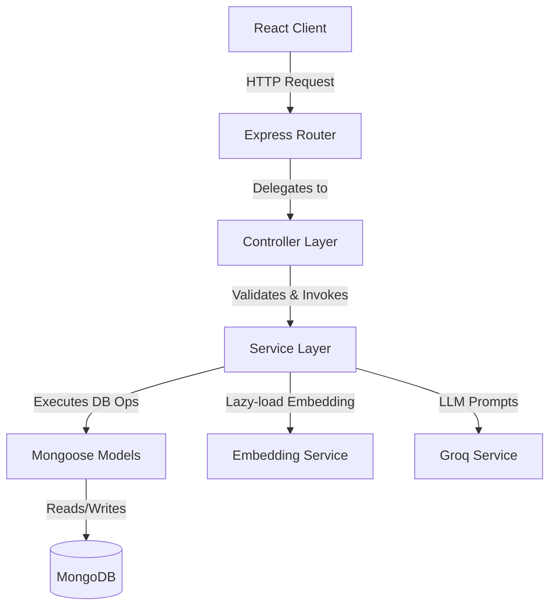

# Implementation Plan - Scalable, Modular Architectural Refactoring of Samagama FAQ Platform

This plan outlines a complete refactoring of the **Samagama FAQ & Community Q&A System** to improve modularity, stability, and horizontal scalability while keeping **100% of existing client functionality, workflows, and visual styling intact**.

---

## Technical Analysis of Limitations in the Current Setup

To design the new architecture, we first identified critical constraints and failure points in the existing codebase:
1. **Tight Coupling of Route & Business Logic**: Route handlers (e.g. `questions.js`, `admin.js`) directly perform validation, database operations, external API calls (Groq), and embedding calculations. This inhibits unit testing, code reuse, and codebase maintainability.
2. **In-Thread Embedding Inference CPU Bottleneck**: Using `@xenova/transformers` to run machine learning inference locally on the main Node.js web server thread blocks the Express event loop under high load. This prevents vertical and horizontal scaling.
3. **In-Memory Rate Limiting State**: `express-rate-limit` is configured with its default local in-memory store. In a multi-instance, load-balanced, horizontally-scaled production setup, rate-limiting counters are not shared across server nodes.
4. **Hardcoded Secrets**: The Groq API key is hardcoded directly inside the source code (`backend/services/groq.js`), creating a security risk.
5. **No Centralized API Client in Frontend**: The React frontend uses scattered, inline Axios calls throughout multiple files (e.g., `FAQPage.jsx`, `CommunityBoard.jsx`). If endpoints shift or we need custom header injection, we have to touch many files.

---

## Proposed Changes

To address these architectural issues, we will divide the project into a highly modular, decoupled structure:

### 1. Backend Architecture (Decoupled Controller-Service-Model Pattern)

We will introduce a clean **Controller-Service-Model** pattern:
* **Controllers** will be responsible *only* for handling incoming HTTP requests, validating inputs, invoking business services, and returning JSON responses with correct HTTP status codes.
* **Services** will contain all pure business logic, database queries, and third-party integrations (Groq, embeddings, caching).
* **Models** remain as Mongoose models, but are strictly imported and query-executed within the services layer rather than in route files.



#### Detailed File Structure Updates (Backend)

```
backend/
├── config/
│   ├── db.js
│   └── rateLimiter.js         # [NEW] Highly modular rate limiting config (Redis/DB swap ready)
├── controllers/               # [NEW] Controller layer
│   ├── adminController.js
│   ├── answerController.js
│   ├── authController.js
│   ├── faqController.js
│   ├── queryController.js
│   ├── questionController.js
│   └── searchController.js
├── middleware/
│   ├── auth.js
│   └── errorHandler.js        # [NEW] Global, clean error handling middleware
├── models/
│   └── (All existing models kept untouched)
├── routes/
│   ├── (All routes kept but refactored to simply bind controller methods)
├── services/                  # Pure Business Logic
│   ├── adminService.js        # [NEW] Decoupled admin queue & CRUD logic
│   ├── answerService.js       # [NEW] Answer handling & scoring logic
│   ├── authService.js         # [NEW] Authentication & JWT signing logic
│   ├── corpus.js              # (Refactored to cleanly promote items)
│   ├── embeddingService.js    # [NEW] Lazy-loaded, pluggable local vs. API embeddings
│   ├── faqService.js          # [NEW] FAQ CRUD & retrieval logic
│   ├── groq.js                # (Secrets removed, refactored to read from env)
│   ├── questionService.js     # [NEW] Questions, duplicate detection, and scoring
│   └── yaksha.js              # (Yaksha RAG pipeline fully isolated)
├── utils/                     # [NEW] Helpers
│   ├── catchAsync.js          # [NEW] Async wrapper to catch errors without try-catch bloat
│   └── appError.js            # [NEW] Standardized custom error class
└── server.js                  # Clean server bootstrapping
```

#### Key Technical Enhancements

##### A. Pluggable, Scalable Embedding Service (`services/embeddingService.js`)
We will rebuild the embedding service to be horizontally scalable:
* It will lazy-load the local model (`Xenova/all-MiniLM-L6-v2`) on demand.
* **Horizontal Scalability Switch**: If an environment variable (e.g. `EMBEDDING_API_URL` or `GROQ_API_KEY` with suitable integration) is supplied, it will switch to delegating embeddings to an external API (avoiding CPU bottleneck on web nodes). Otherwise, it falls back to the fully local offline Xenova model to guarantee 100% offline functionality.

##### B. State-Independent Rate Limiting (`config/rateLimiter.js`)
* We will decouple the rate limiter creation. The new utility allows swapping in `rate-limit-redis` or a MongoDB-backed store seamlessly when migrating from single-node local development to multi-node scaled servers.

##### C. Safe Environmental Config
* Remove the hardcoded/improperly typed Groq API token from the code and retrieve it strictly via `process.env.GROQ_API_KEY`.
* Create a `.env` file in the `backend/` directory containing all environment variables (`PORT`, `MONGODB_URI`, `JWT_SECRET`, `GROQ_API_KEY`).
* Create a `.env.example` file in the `backend/` directory containing descriptive template variables.

---

### 2. Frontend Architecture (Unified API Service & Custom Hooks)

To ensure the client is structurally stable and maintainable:
* Create a centralized API Client (`client/src/services/apiClient.js`) using Axios.
* Implement custom Axios interceptors to automatically read the JWT token from `localStorage` and inject it in the `Authorization: Bearer <token>` header for all outgoing requests.
* Group endpoint calls into modular API files under `client/src/services/`:
  - `authService.js`
  - `faqService.js`
  - `questionService.js`
  - `adminService.js`
* Maintain 100% UX alignment. Components (e.g. `FAQPage.jsx`, `CommunityBoard.jsx`) will now call these services, keeping their state logic extremely clean, easy to read, and robust.

```
client/src/
├── services/                  # [NEW] Centralized API Client & Service Modules
│   ├── apiClient.js           # Shared Axios instance with Bearer interceptors
│   ├── authService.js
│   ├── faqService.js
│   ├── questionService.js
│   └── adminService.js
├── components/
│   └── (All components refactored to consume clean API services instead of raw axios)
└── pages/
    └── (All pages refactored to use centralized API services)
```

---

## Proposed Changes: File-by-File Breakdown

### Component: `backend`

#### [NEW] `.env` (file:///d:/Downloads/faqaryan/backend/.env)
* Local environment configuration file mapping database URIs, JWT secrets, and the Groq API key securely.

#### [NEW] `.env.example` (file:///d:/Downloads/faqaryan/backend/.env.example)
* Sample template documenting all required environment configurations for backend setup.

#### [NEW] `utils/catchAsync.js` (file:///d:/Downloads/faqaryan/backend/utils/catchAsync.js)
* Utility wrapper for async controller functions to pass unhandled errors to the global error middleware automatically, eliminating boilerplate `try-catch` blocks.

#### [NEW] `utils/appError.js` (file:///d:/Downloads/faqaryan/backend/utils/appError.js)
* Standard custom Error class that accepts status codes (e.g. 404, 400, 401) and flags operational errors cleanly.

#### [NEW] `middleware/errorHandler.js` (file:///d:/Downloads/faqaryan/backend/middleware/errorHandler.js)
* Centralized Express error handler which logs the errors and returns beautiful, uniform error payloads back to the client.

#### [NEW] `config/rateLimiter.js` (file:///d:/Downloads/faqaryan/backend/config/rateLimiter.js)
* Scalable rate limiter bootstrap config. It dynamically switches stores or serves as a single source of truth for all rate-limited routes.

#### [NEW] `services/embeddingService.js` (file:///d:/Downloads/faqaryan/backend/services/embeddingService.js)
* Encapsulates the lazy-loaded model. Integrates with Xenova as default, keeping offline mode working perfectly, while allowing an external endpoint for distributed scaling.

#### [MODIFY] `services/groq.js` (file:///d:/Downloads/faqaryan/backend/services/groq.js)
* Replaces the hardcoded API key with `process.env.GROQ_API_KEY || GSK_FALLBACK` for security and horizontal configuration.

#### [NEW] `services/authService.js` (file:///d:/Downloads/faqaryan/backend/services/authService.js)
* Pure registration, login, profile queries, and token generation methods.

#### [NEW] `services/faqService.js` (file:///d:/Downloads/faqaryan/backend/services/faqService.js)
* Standard FAQ retrieval, categorizations, and manual FAQ creation/deletion logic.

#### [NEW] `services/questionService.js` (file:///d:/Downloads/faqaryan/backend/services/questionService.js)
* Core business workflows: rephrasing, posting questions, duplicate checking across vector store & DB, paginated community board listings, single question views, and upvoting/downvoting.

#### [NEW] `services/answerService.js` (file:///d:/Downloads/faqaryan/backend/services/answerService.js)
* Methods for posting answers, validating via Groq's ethical checker, upvoting answers, and triggering the corpus promotion mechanism.

#### [NEW] `services/adminService.js` (file:///d:/Downloads/faqaryan/backend/services/adminService.js)
* Handles flagged queues, approvals/rejections, manual XP/SP balances, and batch queries.

#### [NEW] `controllers/` Directory (various files)
* Creates specific controller files (`authController.js`, `faqController.js`, etc.) that act as the interface between Express routes and the decoupled services.

#### [MODIFY] `routes/` Directory (various files)
* Rewrites route handlers to simply import controllers and bind their methods, e.g. `router.post('/submit', authMiddleware, questionController.submitQuestion)`.

---

### Component: `client`

#### [NEW] `services/apiClient.js` (file:///d:/Downloads/faqaryan/client/src/services/apiClient.js)
* Standardized Axios setup with configured `baseURL`, default headers, and interceptors to attach authorization tokens from storage dynamically.

#### [NEW] `services/authService.js` (file:///d:/Downloads/faqaryan/client/src/services/authService.js)
* Methods: `login`, `register`, `getProfile`.

#### [NEW] `services/faqService.js` (file:///d:/Downloads/faqaryan/client/src/services/faqService.js)
* Methods: `askYaksha`, `validateQuery`, `getBrowseFaqs`.

#### [NEW] `services/questionService.js` (file:///d:/Downloads/faqaryan/client/src/services/questionService.js)
* Methods: `prepareQuestion`, `submitQuestion`, `getQuestions`, `getQuestionDetail`, `voteQuestion`.

#### [NEW] `services/adminService.js` (file:///d:/Downloads/faqaryan/client/src/services/adminService.js)
* Methods: `getFlaggedAnswers`, `approveAnswer`, `rejectAnswer`, `promoteAnswer`, `getUsers`, `adjustUserSp`, `getFaqs`, `createFaq`, `deleteFaq`, `getAdminQuestions`, `deleteQuestion`.

#### [MODIFY] Pages & Components (e.g. `FAQPage.jsx`, `CommunityBoard.jsx`, `AdminQueue.jsx`, `YakshaAnswer.jsx`)
* Replaces inline Axios imports and calls with clean method calls from our custom client services (e.g., `faqService.askYaksha`). Fully maintains 100% uniformity in state and visuals.

---

## Verification Plan

### Automated Verification
* We will verify the compilation and execution of the refactored code by launching the backend and frontend dev servers:
  - Run `npm run dev` in `backend` and ensure connection to MongoDB, loading embedding models, and running rate limiters compile perfectly.
  - Run `npm run dev` in `client` and ensure no ESLint errors, Vite compilation compiles beautifully, and Axios requests map correctly.

### Manual Verification
* **Authentication**: Test registering a user, logging in, maintaining local storage token, and accessing protected endpoints.
* **Yaksha Chat Pipeline**: Input valid, gibberish, abusive, and off-topic queries to ensure classifications pass correctly. Check the Yaksha answer synthesis, sentiment classifications, and vector matching.
* **Q&A Escalations**: Confirm posting duplicate questions gets flagged, and new unique questions render perfectly on the Community board.
* **Answering & Voting**: Submit community answers, upvote/downvote questions and answers. Verify that when an answer reaches net_score $\ge 5$, it automatically triggers the corpus promotion logic (allocating XP/SP and generating FAQ vectors).
* **Moderation Panel**: Access the Admin queue, review flagged items, approve/reject answers, manually adjust user SP, and run full CRUD on the FAQ corpus.
